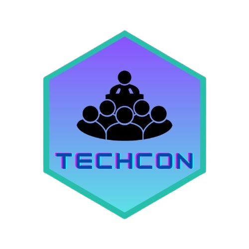

<!-- <a name="readme-top"></a> -->

<!-- PROJECT SHIELDS -->
<p align="center">

[![Contributors][contributors-shield]][contributors-url]
[![Forks][forks-shield]][forks-url]
[![Stargazers][stars-shield]][stars-url]
[![Issues][issues-shield]][issues-url]
[![MIT License][license-shield]][license-url]
[![LinkedIn][linkedin-shield]][linkedin-url]

</p>


<!-- PROJECT LOGO -->
<br />
<div align="center">
 <a href="">
    
  </a>

  <h3 align="center">TechCon</h3>

  <p align="center">
    A Website for upcoming Tech Conferences
    <br />
    <a href="https://github.com/DevHrithik/TechCon"><strong>Explore the docs »</strong></a>
    <br />
    <br />
    <!-- <a href="https://github.com/othneildrew/Best-README-Template">View Demo</a> -->
    ·
    <a href="https://github.com/DevHrithik/TechCon/issues">Report Bug</a>
    ·
    <a href="https://github.com/DevHrithik/TechCon/issues/new">Request Feature</a>
  </p>
</div>


<!-- TABLE OF CONTENTS -->
<details>
  <summary>Table of Contents</summary>
  <ol>
    <li>
      <a href="#about-the-project">About The Project</a>
      <ul>
        <li><a href="#built-with">Built With</a></li>
      </ul>
    </li>
    <li>
      <a href="#getting-started">Getting Started</a>
      <ul>
        <li><a href="#prerequisites">Prerequisites</a></li>
        <li><a href="#installation">Installation</a></li>
      </ul>
    </li>
    <li><a href="#usage">Usage</a></li>
    <li><a href="#license">License</a></li>
    <li><a href="#contact">Contact</a></li>
  </ol>
</details>


<!-- ABOUT THE PROJECT -->
## About The Project

<!-- [![Product Name Screen Shot][product-screenshot]](https://example.com) -->

TechCon: Your Hub for Upcoming Tech Conferences

TechCon stands as a dedicated platform that compiles a comprehensive list of imminent tech conferences. This website serves as an integral component of a recruitment assignment for the esteemed role of GDSC JU Dev Core Member.

Harnessing the fundamental building blocks of HTML, CSS, and JavaScript, I have crafted this dynamic website. The backbone of TechCon is an API graciously provided by GDSC JU, which furnishes a wealth of data in JSON format. Through adept manipulation and parsing, this data seamlessly transforms into an interactive HTML table, thoughtfully adorned with customization via basic CSS and Bootstrap.

While my aspirations lie in the realm of becoming a DevOps Engineer, embarking on the TechCon project has proven immensely enjoyable and intellectually stimulating. It has been an opportunity for me to immerse myself in the intricacies of JSON and API integration, adding a diverse skill set to my repertoire.

I extend a warm invitation to explore this simple yet impactful website, which you can access by simply {clicking here]. Dive into the world of upcoming tech conferences, experience the elegant synergy of code and design, and join me on this exciting journey of learning and innovation.

<p align="right">(<a href="#readme-top">back to top</a>)</p>


### Built With

I build this website using very basic tools listed below:

* [![HTML][HTML.com]][HTML-url]
* [![CSS][CSS.com]][CSS-url]
* [![Bootstrap][Bootstrap.com]][Bootstrap-url]
* [![Javascript][Javascript.com]][JAVASCRIPT-url]


<p align="right">(<a href="#readme-top">back to top</a>)</p>


<!-- GETTING STARTED -->
## Getting Started

This is a website for the upcoming Tech Conferences happening around the world.

### Prerequisites
If you're considering involvement in this project, there are specific software tools and extensions that you'll need. They're outlined below for your reference:
1.  [![VS Code][VS-Code.shield]][VS-CODE-url]
2. A Extention Called [Live Server](https://marketplace.visualstudio.com/items?itemName=ritwickdey.LiveServer)

### Installation

1. Clone the repo
   ```sh
   git clone https://github.com/DevHrithik/TechCon.git
   ```
2. Go into the repository
   ```sh
   cd TechCon
   ```
3. Open in VS Code

4. Click on the Go Live icon 

<p align="right">(<a href="#readme-top">back to top</a>)</p>


<!-- USAGE EXAMPLES -->
## Usage

* This website proves to be incredibly valuable for discovering tech conferences in close proximity. It serves as an excellent tool to meticulously strategize your engagement in these conferences, allowing for effective pre-planning. Moreover, these conferences offer a unique avenue to harness the potential of networking, ultimately propelling your career forward.

* Embracing these conferences not only nurtures networking potential but also enhances career prospects. As you participate, you're presented with the chance to refine public speaking skills, broaden your industry knowledge, and establish meaningful connections with fellow professionals.


<p align="right">(<a href="#readme-top">back to top</a>)</p>


<!-- CONTRIBUTING -->
## Contributing

Contributions are what make the open source community such an amazing place to learn, inspire, and create. Any contributions you make are **greatly appreciated**.

If you have a suggestion that would make this better, please fork the repo and create a pull request. You can also simply open an issue with the tag "enhancement".
Don't forget to give the project a star! Thanks again!

1. Fork the Project
2. Create your Feature Branch 
3. Commit your Changes
4. Push to the Branch 
5. Open a Pull Request

<p align="right">(<a href="#readme-top">back to top</a>)</p>


<!-- LICENSE -->
## License

Distributed under the MIT License. See `LICENSE.txt` for more information.

<p align="right">(<a href="#readme-top">back to top</a>)</p>


<!-- CONTACT -->
## Contact

Hrithik Roy - [@Hrithikstwts](https://twitter.com/Hrithikstwts) - hrithikroy1854@gmail.com

<p align="right">(<a href="#readme-top">back to top</a>)</p>


<!-- MARKDOWN LINKS & IMAGES -->
<!-- https://www.markdownguide.org/basic-syntax/#reference-style-links -->
[contributors-shield]: https://img.shields.io/github/contributors/DevHrithik/TechCon.svg?style=for-the-badge
[contributors-url]: https://github.com/DevHrithik/TechCon/graphs/contributors
[forks-shield]: https://img.shields.io/github/forks/DevHrithik/TechCon.svg?style=for-the-badge
[forks-url]: https://github.com/othneildrew/Best-README-Template/network/members
[stars-shield]: https://img.shields.io/github/stars/DevHrithik/TechCon.svg?style=for-the-badge
[stars-url]: https://github.com/DevHrithik/TechCon/stargazers
[issues-shield]: https://img.shields.io/github/issues/DevHrithik/TechCon.svg?style=for-the-badge
[issues-url]: https://github.com/DevHrithik/TechCon/issues
[license-shield]: https://img.shields.io/github/license/DevHrithik/TechCon.svg?style=for-the-badge
[license-url]: https://github.com/DevHrithik/TechCon/blob/main/LICENSE
[linkedin-shield]: https://img.shields.io/badge/-LinkedIn-black.svg?style=for-the-badge&logo=linkedin&colorB=555
[linkedin-url]: https://linkedin.com/in/devhrithik
[VS-Code.shield]:https://img.shields.io/badge/Visual_Studio_Code-0078D4?style=for-the-badge&logo=visual%20studio%20code&logoColor=white
[VS-CODE-url]:https://code.visualstudio.com/
[product-screenshot]: images/screenshot.png
[HTML.com]: https://img.shields.io/badge/HTML5-E34F26?style=for-the-badge&logo=html5&logoColor=white
[HTML-url]: https://developer.mozilla.org/en-US/docs/Web/HTML
[CSS.com]: https://img.shields.io/badge/CSS3-1572B6?style=for-the-badge&logo=css3&logoColor=white
[CSS-url]: https://www.w3schools.com/css/
[Bootstrap.com]: https://img.shields.io/badge/Bootstrap-563D7C?style=for-the-badge&logo=bootstrap&logoColor=white
[Bootstrap-url]: https://getbootstrap.com
[Javascript.com]:https://img.shields.io/badge/JavaScript-323330?style=for-the-badge&logo=javascript&logoColor=F7DF1E
[Javascript-url]:https://developer.mozilla.org/en-US/docs/Web/JavaScript
